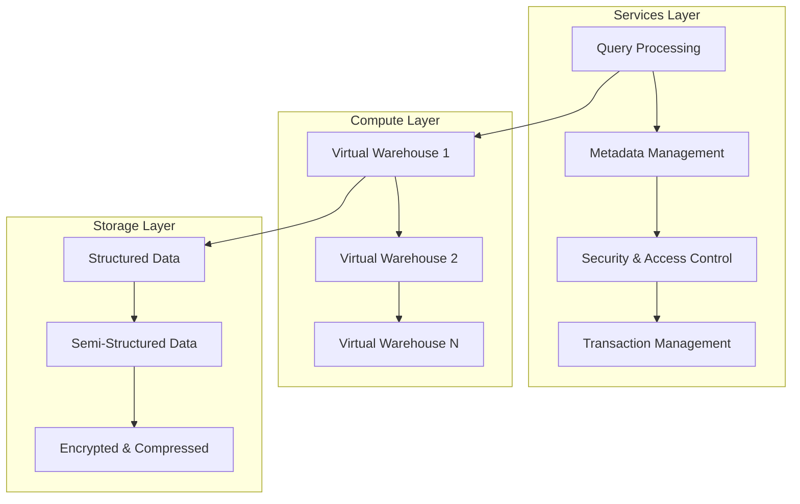
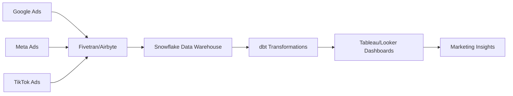

# ❄️ Snowflake Complete Guide: From Zero to Hero

<div align="center">


### 🚀 **The Ultimate Snowflake Resource for Analysts, Marketers & Data Engineers**

*Curated by Senior Digital Marketing Analysts | Battle-tested in production environments*

[](https://github.com/Karanpreet03/SnowflakeResources)
[](https://github.com/Karanpreet03/SnoflakeResources/fork)
[](https://docs.snowflake.com)

</div>

---

## 📋 Table of Contents

- [🎯 Quick Start](#-quick-start)
- [🌨️ What is Snowflake?](#️-what-is-snowflake)
- [🏗️ Architecture Deep Dive](#️-architecture-deep-dive)
- [🧠 Core Concepts](#-core-concepts)
- [📈 Real-World Use Cases](#-real-world-use-cases)
- [💻 Essential SQL Commands](#-essential-sql-commands)
- [🛠️ Recommended Tools & Integrations](#️-recommended-tools--integrations)
- [🎓 Interactive Learning](#-interactive-learning)
- [📊 Performance Optimization](#-performance-optimization)
- [🔐 Security Best Practices](#-security-best-practices)
- [💡 Pro Tips & Tricks](#-pro-tips--tricks)
- [📚 Additional Resources](#-additional-resources)
- [👥 Contributing](#-contributing)

---

## 🎯 Quick Start

> **New to Snowflake?** Start here for a 5-minute overview!

### What You'll Learn
- ✅ Understand Snowflake's unique architecture
- ✅ Master essential SQL commands for analytics
- ✅ Implement real marketing use cases
- ✅ Optimize for performance and cost
- ✅ Build production-ready data pipelines

### Prerequisites
```bash
# Basic Requirements
✓ SQL knowledge (intermediate level)
✓ Understanding of data warehousing concepts
✓ Access to Snowflake account (30-day free trial available)
```

---

## 🌨️ What is Snowflake?

Snowflake is a **cloud-native data platform** that revolutionizes how organizations store, process, and analyze data. Unlike traditional databases, Snowflake separates storage and compute, enabling unprecedented scalability and cost efficiency.

### 🚀 Key Features

| Feature | Description | Business Impact |
|---------|-------------|-----------------|
| **☁️ Cloud-Native** | Built for AWS, Azure, GCP | No infrastructure management |
| **⚡ Instant Scaling** | Scale up/down in seconds | Pay only for what you use |
| **🔄 Zero-Copy Cloning** | Instant data copies | Fast dev/test environments |
| **📊 Semi-Structured Data** | Native JSON, XML, Avro support | No complex ETL required |
| **⏰ Time Travel** | Access historical data (90 days) | Easy data recovery |
| **🔒 Enterprise Security** | End-to-end encryption | Compliance ready |

### 💰 Pricing Model
```
Compute: $2-3 per credit (varies by region)
Storage: $23-40 per TB per month
Data Transfer: $0.01-0.12 per GB

💡 Pro Tip: Use auto-suspend to minimize compute costs!
```

---

## 🏗️ Architecture Deep Dive

Snowflake's **multi-cluster, shared data architecture** is what makes it special. Here's how it works:



### 🔧 Architecture Components

#### 1. **Storage Layer** 🗄️
- **What it does**: Stores all data with automatic compression and encryption
- **Key benefits**: 
  - Infinite scalability
  - Cross-region replication
  - Automatic optimization
- **Best practices**: 
  - Use clustering keys for large tables (>1TB)
  - Leverage semi-structured data features

#### 2. **Compute Layer** ⚙️
- **What it does**: Processes queries using virtual warehouses
- **Sizing options**:
  ```
  XS:   1 server,  8 cores  → Light workloads
  S:    2 servers, 16 cores → Standard queries  
  M:    4 servers, 32 cores → Medium workloads
  L:    8 servers, 64 cores → Heavy analytics
  XL:   16 servers           → Very large datasets
  2XL+: Up to 512 servers    → Extreme workloads
  ```

#### 3. **Services Layer** 🛠️
- **Query optimization**: Automatic query planning
- **Metadata management**: Schema, statistics, access control
- **Security**: Authentication, authorization, audit logging

---

## 🧠 Core Concepts

### 📊 Database Objects Hierarchy

```
Account
├── Database
│   ├── Schema
│   │   ├── Tables
│   │   ├── Views
│   │   ├── Stored Procedures
│   │   └── User-Defined Functions
│   └── Stages (Internal/External)
└── Warehouses
```

### 🏭 Virtual Warehouses

Virtual warehouses are **compute clusters** that execute your queries. Think of them as the "engines" of your data processing.

```sql
-- Create a warehouse
CREATE WAREHOUSE analytics_wh WITH
    WAREHOUSE_SIZE = 'MEDIUM'
    AUTO_SUSPEND = 300        -- Suspend after 5 minutes
    AUTO_RESUME = TRUE        -- Resume automatically
    INITIALLY_SUSPENDED = TRUE;

-- Resize on demand
ALTER WAREHOUSE analytics_wh SET WAREHOUSE_SIZE = 'LARGE';
```

### ⏰ Time Travel & Fail-Safe

One of Snowflake's most powerful features for data recovery:

```sql
-- Query data from 1 hour ago
SELECT * FROM my_table AT (OFFSET => -3600);

-- Query data from specific timestamp
SELECT * FROM my_table AT (TIMESTAMP => '2024-01-01 12:00:00'::timestamp);

-- Restore accidentally deleted data
CREATE TABLE my_table_restored CLONE my_table AT (OFFSET => -1800);
```

**Time Travel Retention:**
- Standard tables: 1 day (configurable up to 90 days)
- Fail-safe: Additional 7 days (Snowflake-only recovery)

### 🗂️ Stages & Data Loading

Stages are **named locations** for storing data files:

```sql
-- Create internal stage
CREATE STAGE my_internal_stage;

-- Create external stage (S3 example)
CREATE STAGE my_s3_stage
    URL = 's3://my-bucket/data/'
    CREDENTIALS = (AWS_KEY_ID = 'xxx' AWS_SECRET_KEY = 'yyy');

-- Load data
COPY INTO my_table
FROM @my_s3_stage/file.csv
FILE_FORMAT = (TYPE = 'CSV' FIELD_DELIMITER = ',' SKIP_HEADER = 1);
```

---

## 📈 Real-World Use Cases

### 🎯 Marketing Analytics Pipeline

Here's how modern marketing teams use Snowflake:



#### 1. **Attribution Modeling** 🔍

```sql
-- Multi-touch attribution analysis
WITH customer_touchpoints AS (
    SELECT 
        customer_id,
        touchpoint_type,
        touchpoint_time,
        channel,
        campaign_id,
        cost,
        LAG(touchpoint_time) OVER (
            PARTITION BY customer_id 
            ORDER BY touchpoint_time
        ) AS prev_touchpoint_time
    FROM marketing_touchpoints
    WHERE customer_id IS NOT NULL
),

attribution_weights AS (
    SELECT 
        customer_id,
        touchpoint_type,
        channel,
        campaign_id,
        cost,
        -- Time-decay attribution (more recent = higher weight)
        EXP(-DATEDIFF('hour', touchpoint_time, conversion_time) / 24.0) AS weight
    FROM customer_touchpoints ct
    JOIN conversions c ON ct.customer_id = c.customer_id
)

SELECT 
    channel,
    campaign_id,
    SUM(cost) AS total_spend,
    SUM(weight) AS attributed_conversions,
    SUM(cost) / SUM(weight) AS cost_per_attributed_conversion
FROM attribution_weights
GROUP BY channel, campaign_id
ORDER BY attributed_conversions DESC;
```

#### 2. **Customer Lifetime Value (CLV)** 💰

```sql
-- Calculate CLV using cohort analysis
WITH monthly_cohorts AS (
    SELECT 
        customer_id,
        DATE_TRUNC('month', first_purchase_date) AS cohort_month,
        DATEDIFF('month', cohort_month, purchase_date) AS period_number,
        purchase_amount
    FROM customer_purchases
),

cohort_data AS (
    SELECT 
        cohort_month,
        period_number,
        COUNT(DISTINCT customer_id) AS customers,
        SUM(purchase_amount) AS revenue,
        AVG(purchase_amount) AS avg_order_value
    FROM monthly_cohorts
    GROUP BY cohort_month, period_number
)

SELECT 
    cohort_month,
    period_number,
    customers,
    revenue,
    avg_order_value,
    revenue / LAG(customers) OVER (
        PARTITION BY cohort_month 
        ORDER BY period_number
    ) AS revenue_per_customer
FROM cohort_data
ORDER BY cohort_month, period_number;
```

#### 3. **Real-Time Campaign Optimization** 📊

```sql
-- Hourly campaign performance monitoring
CREATE TASK campaign_performance_monitor
    WAREHOUSE = analytics_wh
    SCHEDULE = 'USING CRON 0 * * * * UTC'  -- Every hour
AS
INSERT INTO campaign_alerts
SELECT 
    campaign_id,
    channel,
    current_timestamp AS alert_time,
    'HIGH_CPA' AS alert_type,
    cost_per_acquisition,
    target_cpa
FROM (
    SELECT 
        campaign_id,
        channel,
        SUM(cost) / NULLIF(SUM(conversions), 0) AS cost_per_acquisition,
        MAX(target_cpa) AS target_cpa
    FROM hourly_campaign_metrics
    WHERE date_hour >= DATEADD('hour', -1, CURRENT_TIMESTAMP)
    GROUP BY campaign_id, channel
) 
WHERE cost_per_acquisition > target_cpa * 1.2;  -- 20% over target
```

### 🛍️ E-commerce Analytics

#### Product Recommendation Engine
```sql
-- Collaborative filtering for product recommendations
WITH user_item_matrix AS (
    SELECT 
        user_id,
        product_id,
        SUM(quantity * rating) AS preference_score
    FROM purchase_history p
    JOIN product_ratings r USING (user_id, product_id)
    GROUP BY user_id, product_id
),

similar_users AS (
    SELECT 
        a.user_id AS user_a,
        b.user_id AS user_b,
        CORR(a.preference_score, b.preference_score) AS similarity
    FROM user_item_matrix a
    JOIN user_item_matrix b ON a.product_id = b.product_id
    WHERE a.user_id < b.user_id  -- Avoid duplicates
    GROUP BY a.user_id, b.user_id
    HAVING similarity > 0.3  -- Only similar users
)

SELECT 
    user_a AS target_user,
    product_id,
    AVG(preference_score * similarity) AS recommendation_score
FROM similar_users su
JOIN user_item_matrix uim ON su.user_b = uim.user_id
WHERE product_id NOT IN (
    SELECT product_id 
    FROM user_item_matrix 
    WHERE user_id = su.user_a
)
GROUP BY user_a, product_id
QUALIFY ROW_NUMBER() OVER (PARTITION BY user_a ORDER BY recommendation_score DESC) <= 10;
```

---

## 💻 Essential SQL Commands

### 🚀 Database & Schema Management

```sql
-- Create database with options
CREATE DATABASE marketing_analytics
    DATA_RETENTION_TIME_IN_DAYS = 7
    COMMENT = 'Marketing analytics database';

-- Use database
USE DATABASE marketing_analytics;

-- Create schema with managed access
CREATE SCHEMA campaign_data WITH MANAGED ACCESS;

-- Grant permissions
GRANT USAGE ON DATABASE marketing_analytics TO ROLE analyst_role;
GRANT ALL ON SCHEMA campaign_data TO ROLE analyst_role;
```

### 📊 Advanced Table Operations

```sql
-- Create table with clustering
CREATE TABLE large_campaign_data (
    date_key DATE,
    campaign_id STRING,
    impressions NUMBER,
    clicks NUMBER,
    cost DECIMAL(10,2),
    conversions NUMBER
)
CLUSTER BY (date_key, campaign_id);

-- Create transient table (no fail-safe, lower cost)
CREATE TRANSIENT TABLE staging_data (
    raw_data VARIANT,
    loaded_at TIMESTAMP DEFAULT CURRENT_TIMESTAMP
);

-- Create table from query with zero-copy clone
CREATE TABLE campaign_backup CLONE campaign_data;
```

### 🔄 Data Loading & ETL

```sql
-- Create file format
CREATE FILE FORMAT csv_format
    TYPE = 'CSV'
    FIELD_DELIMITER = ','
    RECORD_DELIMITER = '\n'
    SKIP_HEADER = 1
    FIELD_OPTIONALLY_ENCLOSED_BY = '"'
    NULL_IF = ('NULL', 'null', '')
    ERROR_ON_COLUMN_COUNT_MISMATCH = FALSE;

-- Bulk load with pattern matching
COPY INTO campaign_data
FROM @external_stage
PATTERN = '.*campaign_data_2024.*\.csv'
FILE_FORMAT = csv_format
ON_ERROR = 'CONTINUE';

-- Stream processing setup
CREATE STREAM campaign_stream ON TABLE campaign_data;

-- Process stream data
MERGE INTO campaign_summary target
USING (
    SELECT 
        campaign_id,
        SUM(impressions) AS total_impressions,
        SUM(clicks) AS total_clicks,
        SUM(cost) AS total_cost
    FROM campaign_stream
    WHERE METADATA$ACTION = 'INSERT'
    GROUP BY campaign_id
) source
ON target.campaign_id = source.campaign_id
WHEN MATCHED THEN UPDATE SET
    total_impressions = target.total_impressions + source.total_impressions,
    total_clicks = target.total_clicks + source.total_clicks,
    total_cost = target.total_cost + source.total_cost
WHEN NOT MATCHED THEN INSERT VALUES (
    source.campaign_id,
    source.total_impressions,
    source.total_clicks,
    source.total_cost
);
```

### 📈 Advanced Analytics Queries

```sql
-- Window functions for cohort analysis
WITH user_cohorts AS (
    SELECT 
        user_id,
        DATE_TRUNC('month', MIN(purchase_date)) AS cohort_month
    FROM purchases
    GROUP BY user_id
),

purchase_periods AS (
    SELECT 
        p.user_id,
        uc.cohort_month,
        DATE_TRUNC('month', p.purchase_date) AS purchase_month,
        DATEDIFF('month', uc.cohort_month, DATE_TRUNC('month', p.purchase_date)) AS period_number,
        p.amount
    FROM purchases p
    JOIN user_cohorts uc ON p.user_id = uc.user_id
)

SELECT 
    cohort_month,
    period_number,
    COUNT(DISTINCT user_id) AS active_users,
    SUM(amount) AS revenue,
    AVG(amount) AS avg_revenue_per_user,
    -- Retention rate
    COUNT(DISTINCT user_id) / FIRST_VALUE(COUNT(DISTINCT user_id)) 
        OVER (PARTITION BY cohort_month ORDER BY period_number) AS retention_rate
FROM purchase_periods
GROUP BY cohort_month, period_number
ORDER BY cohort_month, period_number;
```

### 🔍 Working with Semi-Structured Data

```sql
-- Parse JSON data
SELECT 
    raw_data:event_name::STRING AS event_name,
    raw_data:user_id::STRING AS user_id,
    raw_data:properties:campaign_id::STRING AS campaign_id,
    raw_data:properties:revenue::NUMBER AS revenue,
    raw_data:timestamp::TIMESTAMP AS event_timestamp
FROM events_json
WHERE raw_data:event_name = 'purchase';

-- Flatten nested arrays
SELECT 
    user_id,
    value:product_id::STRING AS product_id,
    value:quantity::NUMBER AS quantity,
    value:price::NUMBER AS price
FROM purchase_data,
LATERAL FLATTEN(input => raw_data:items) AS f;

-- Create view on semi-structured data
CREATE VIEW clean_events AS
SELECT 
    raw_data:event_id::STRING AS event_id,
    raw_data:user_id::STRING AS user_id,
    raw_data:event_name::STRING AS event_name,
    TO_TIMESTAMP(raw_data:timestamp::NUMBER) AS event_timestamp,
    PARSE_JSON(raw_data:properties) AS properties
FROM raw_events
WHERE raw_data:event_name IS NOT NULL;
```

---

## 🛠️ Recommended Tools & Integrations

### 🔄 ETL/ELT Tools

| Tool | Use Case | Pros | Cons | Cost |
|------|----------|------|------|------|
| **Fivetran** | Automated data pipelines | 150+ connectors, reliable | Expensive for high volume | $1-5/MAR |
| **Airbyte** | Open-source EL | Free, extensible | Requires more setup | Free/Paid |
| **dbt** | Data transformations | Version control, testing | SQL-only | Free/Paid |
| **Stitch** | Simple data integration | Easy setup | Limited transformations | $100+/month |

### 📊 Business Intelligence

```sql
-- Example dbt model for BI tools
-- models/marts/marketing/campaign_performance.sql
{{ config(materialized='table') }}

WITH daily_metrics AS (
    SELECT 
        date_key,
        campaign_id,
        campaign_name,
        channel,
        SUM(impressions) AS impressions,
        SUM(clicks) AS clicks,
        SUM(cost) AS cost,
        SUM(conversions) AS conversions
    FROM {{ ref('staging_campaign_data') }}
    GROUP BY 1, 2, 3, 4
)

SELECT 
    *,
    CASE 
        WHEN impressions > 0 THEN (clicks::FLOAT / impressions) * 100 
        ELSE 0 
    END AS ctr,
    CASE 
        WHEN conversions > 0 THEN cost / conversions 
        ELSE NULL 
    END AS cost_per_conversion,
    CASE 
        WHEN clicks > 0 THEN (conversions::FLOAT / clicks) * 100 
        ELSE 0 
    END AS conversion_rate
FROM daily_metrics
```

### 🤖 Automation & Orchestration

```sql
-- Snowflake Tasks for automation
CREATE TASK daily_campaign_summary
    WAREHOUSE = analytics_wh
    SCHEDULE = 'USING CRON 0 8 * * * UTC'  -- Daily at 8 AM UTC
AS
EXECUTE IMMEDIATE $$
BEGIN
    -- Refresh campaign summary
    MERGE INTO campaign_summary_daily target
    USING (
        SELECT 
            CURRENT_DATE - 1 AS date_key,
            campaign_id,
            SUM(cost) AS daily_cost,
            SUM(conversions) AS daily_conversions
        FROM campaign_data
        WHERE DATE(created_at) = CURRENT_DATE - 1
        GROUP BY campaign_id
    ) source
    ON target.date_key = source.date_key 
       AND target.campaign_id = source.campaign_id
    WHEN MATCHED THEN UPDATE SET
        daily_cost = source.daily_cost,
        daily_conversions = source.daily_conversions
    WHEN NOT MATCHED THEN INSERT VALUES (
        source.date_key,
        source.campaign_id,
        source.daily_cost,
        source.daily_conversions
    );
    
    -- Send alert for campaigns over budget
    INSERT INTO campaign_alerts
    SELECT 
        campaign_id,
        'OVER_BUDGET' AS alert_type,
        daily_cost,
        daily_budget,
        CURRENT_TIMESTAMP AS alert_time
    FROM campaign_summary_daily cs
    JOIN campaign_budgets cb USING (campaign_id)
    WHERE cs.date_key = CURRENT_DATE - 1
      AND cs.daily_cost > cb.daily_budget * 1.1;
      
END;
$$;

-- Start the task
ALTER TASK daily_campaign_summary RESUME;
```

---

## 🎓 Interactive Learning

### 📚 Hands-On Exercises

#### Exercise 1: Customer Segmentation
```sql
-- Challenge: Create customer segments based on purchase behavior
-- Your task: Complete this query to segment customers

WITH customer_metrics AS (
    SELECT 
        customer_id,
        COUNT(*) AS total_orders,
        SUM(order_value) AS total_spent,
        AVG(order_value) AS avg_order_value,
        DATEDIFF('day', MIN(order_date), MAX(order_date)) AS customer_lifespan,
        MAX(order_date) AS last_order_date
    FROM orders
    GROUP BY customer_id
)

SELECT 
    customer_id,
    total_orders,
    total_spent,
    avg_order_value,
    CASE 
        WHEN _________ THEN 'VIP'
        WHEN _________ THEN 'Loyal'
        WHEN _________ THEN 'At Risk'
        ELSE 'New'
    END AS customer_segment
FROM customer_metrics;

-- Solution hint: Consider recency, frequency, and monetary value
```

#### Exercise 2: Funnel Analysis
```sql
-- Challenge: Calculate conversion rates at each funnel step
-- Events: page_view → add_to_cart → checkout → purchase

-- Your solution here:
```

### 🧪 Practice Datasets

Clone these datasets to practice:

```sql
-- Sample e-commerce data
CREATE TABLE practice_orders AS
SELECT 
    UNIFORM(1, 10000, RANDOM()) AS customer_id,
    DATEADD('day', -UNIFORM(1, 365, RANDOM()), CURRENT_DATE) AS order_date,
    UNIFORM(10, 500, RANDOM()) AS order_value,
    ARRAY_CONSTRUCT('Electronics', 'Clothing', 'Home', 'Books')[UNIFORM(0, 3, RANDOM())] AS category
FROM TABLE(GENERATOR(ROWCOUNT => 50000));

-- Sample marketing campaign data
CREATE TABLE practice_campaigns AS
SELECT 
    'CAMP_' || LPAD(ROW_NUMBER() OVER (ORDER BY NULL), 4, '0') AS campaign_id,
    DATEADD('day', -UNIFORM(1, 90, RANDOM()), CURRENT_DATE) AS campaign_date,
    UNIFORM(1000, 10000, RANDOM()) AS impressions,
    UNIFORM(50, 500, RANDOM()) AS clicks,
    UNIFORM(500, 5000, RANDOM()) AS cost,
    UNIFORM(5, 50, RANDOM()) AS conversions
FROM TABLE(GENERATOR(ROWCOUNT => 1000));
```

---

## 📊 Performance Optimization

### 🚀 Query Optimization

#### 1. **Use Clustering Keys**
```sql
-- For large tables (>1TB), clustering improves performance
ALTER TABLE large_campaign_data CLUSTER BY (date_key, campaign_id);

-- Monitor clustering effectiveness
SELECT 
    table_name,
    clustering_key,
    total_constant_percent,
    average_overlaps
FROM INFORMATION_SCHEMA.AUTOMATIC_CLUSTERING_HISTORY
WHERE table_name = 'LARGE_CAMPAIGN_DATA';
```

#### 2. **Optimize JOIN Operations**
```sql
-- ✅ GOOD: Use specific columns in SELECT
SELECT 
    c.campaign_id,
    c.campaign_name,
    SUM(m.cost) AS total_cost
FROM campaigns c
JOIN metrics m ON c.campaign_id = m.campaign_id
WHERE c.status = 'ACTIVE'
GROUP BY c.campaign_id, c.campaign_name;

-- ❌ AVOID: SELECT * with large JOINs
SELECT *
FROM campaigns c
JOIN metrics m ON c.campaign_id = m.campaign_id;
```

#### 3. **Leverage Result Caching**
```sql
-- Enable result caching for repeated queries
ALTER SESSION SET USE_CACHED_RESULT = TRUE;

-- Check cache hit rates
SELECT 
    query_id,
    query_text,
    warehouse_name,
    execution_time,
    bytes_scanned,
    result_cache_hit
FROM INFORMATION_SCHEMA.QUERY_HISTORY
WHERE result_cache_hit = TRUE
ORDER BY start_time DESC
LIMIT 10;
```

### 💰 Cost Optimization

#### 1. **Warehouse Management**
```sql
-- Create cost-optimized warehouses
CREATE WAREHOUSE ETL_WH WITH
    WAREHOUSE_SIZE = 'LARGE'
    AUTO_SUSPEND = 60          -- Suspend after 1 minute
    AUTO_RESUME = TRUE
    MIN_CLUSTER_COUNT = 1
    MAX_CLUSTER_COUNT = 3      -- Multi-cluster for concurrency
    SCALING_POLICY = 'STANDARD';

-- Monitor warehouse usage
SELECT 
    warehouse_name,
    SUM(credits_used) AS total_credits,
    AVG(credits_used_compute) AS avg_compute_credits,
    SUM(credits_used) * 3 AS estimated_cost_usd  -- Approximate
FROM WAREHOUSE_METERING_HISTORY
WHERE start_time >= DATEADD('day', -30, CURRENT_DATE)
GROUP BY warehouse_name
ORDER BY total_credits DESC;
```

#### 2. **Storage Optimization**
```sql
-- Use transient tables for staging data
CREATE TRANSIENT TABLE staging_data (...);

-- Monitor storage costs
SELECT 
    table_name,
    active_bytes / (1024*1024*1024) AS active_gb,
    time_travel_bytes / (1024*1024*1024) AS time_travel_gb,
    failsafe_bytes / (1024*1024*1024) AS failsafe_gb,
    (active_bytes + time_travel_bytes + failsafe_bytes) / (1024*1024*1024) AS total_gb
FROM INFORMATION_SCHEMA.TABLE_STORAGE_METRICS
WHERE schema_name = 'CAMPAIGN_DATA'
ORDER BY total_gb DESC;
```

---

## 🔐 Security Best Practices

### 👥 Role-Based Access Control (RBAC)

```sql
-- Create role hierarchy
CREATE ROLE analyst_role;
CREATE ROLE senior_analyst_role;
CREATE ROLE data_admin_role;

-- Grant role hierarchy
GRANT ROLE analyst_role TO ROLE senior_analyst_role;
GRANT ROLE senior_analyst_role TO ROLE data_admin_role;

-- Grant database permissions
GRANT USAGE ON DATABASE marketing_analytics TO ROLE analyst_role;
GRANT USAGE ON ALL SCHEMAS IN DATABASE marketing_analytics TO ROLE analyst_role;
GRANT SELECT ON ALL TABLES IN DATABASE marketing_analytics TO ROLE analyst_role;

-- Grant warehouse permissions
GRANT USAGE ON WAREHOUSE analytics_wh TO ROLE analyst_role;

-- Create user and assign role
CREATE USER john_analyst 
    PASSWORD = 'StrongPassword123!'
    DEFAULT_ROLE = analyst_role
    MUST_CHANGE_PASSWORD = TRUE;
    
GRANT ROLE analyst_role TO USER john_analyst;
```

### 🔒 Data Protection

```sql
-- Row Access Policies
CREATE ROW ACCESS POLICY campaign_region_policy AS (region_column) RETURNS BOOLEAN ->
    CASE 
        WHEN CURRENT_ROLE() IN ('DATA_ADMIN_ROLE') THEN TRUE
        WHEN CURRENT_ROLE() = 'US_ANALYST_ROLE' AND region_column = 'US' THEN TRUE
        WHEN CURRENT_ROLE() = 'EU_ANALYST_ROLE' AND region_column = 'EU' THEN TRUE
        ELSE FALSE
    END;

-- Apply policy to table
ALTER TABLE campaign_data ADD ROW ACCESS POLICY campaign_region_policy ON (region);

-- Dynamic Data Masking
CREATE MASKING POLICY email_mask AS (val STRING) RETURNS STRING ->
    CASE 
        WHEN CURRENT_ROLE() IN ('DATA_ADMIN_ROLE', 'SENIOR_ANALYST_ROLE') THEN val
        ELSE REGEXP_REPLACE(val, '.+\@', '*****@')
    END;

-- Apply masking policy
ALTER TABLE customers MODIFY COLUMN email SET MASKING POLICY email_mask;
```

### 🛡️ Network Security

```sql
-- Create network policy
CREATE NETWORK POLICY corporate_network_policy
    ALLOWED_IP_LIST = ('192.168.1.0/24', '10.0.0.0/8')
    BLOCKED_IP_LIST = ('192.168.1.100');

-- Apply to account
ALTER ACCOUNT SET NETWORK_POLICY = corporate_network_policy;

-- Clone at specific point in time
CREATE TABLE campaign_data_yesterday CLONE campaign_data 
    AT (TIMESTAMP => DATEADD('day', -1, CURRENT_TIMESTAMP()));

-- Test changes without affecting production
UPDATE campaign_data_test SET status = 'PAUSED' WHERE campaign_id = 'CAMP_001';
-- Original table remains unchanged!
```

#### 2. **Dynamic SQL for Flexible Queries**
```sql
-- Create reusable stored procedure
CREATE OR REPLACE PROCEDURE generate_campaign_report(
    date_range STRING,
    channels ARRAY
)
RETURNS STRING
LANGUAGE SQL
AS
$$
DECLARE
    query_sql STRING;
    result_cursor CURSOR FOR query_sql;
BEGIN
    -- Build dynamic query
    query_sql := 'SELECT campaign_id, channel, SUM(cost) as total_cost, SUM(conversions) as total_conversions FROM campaign_data WHERE date_key >= DATEADD(''day'', -' || date_range || ', CURRENT_DATE) AND channel IN (''' || ARRAY_TO_STRING(channels, ''',''') || ''') GROUP BY campaign_id, channel ORDER BY total_cost DESC';
    
    -- Execute and return results
    OPEN result_cursor FOR query_sql;
    RETURN 'Report generated successfully';
END;
$$;

-- Call the procedure
CALL generate_campaign_report('7', ARRAY_CONSTRUCT('Google', 'Facebook', 'TikTok'));
```

#### 3. **Advanced Window Functions**
```sql
-- Running totals and percentiles
SELECT 
    campaign_id,
    date_key,
    daily_cost,
    -- Running total
    SUM(daily_cost) OVER (
        PARTITION BY campaign_id 
        ORDER BY date_key 
        ROWS UNBOUNDED PRECEDING
    ) AS running_total,
    -- Moving average (7-day)
    AVG(daily_cost) OVER (
        PARTITION BY campaign_id 
        ORDER BY date_key 
        ROWS 6 PRECEDING
    ) AS moving_avg_7d,
    -- Percentile ranking
    PERCENT_RANK() OVER (
        PARTITION BY DATE_TRUNC('month', date_key)
        ORDER BY daily_cost
    ) AS cost_percentile
FROM campaign_daily_metrics
ORDER BY campaign_id, date_key;
```

#### 4. **Smart Data Sampling**
```sql
-- Use SAMPLE for large dataset analysis
SELECT 
    channel,
    AVG(cost_per_click) as avg_cpc,
    COUNT(*) as sample_size
FROM campaign_data SAMPLE (10 ROWS)  -- Sample 10 rows
GROUP BY channel;

-- Percentage-based sampling
SELECT 
    campaign_type,
    MEDIAN(conversion_rate) as median_cvr
FROM campaign_data SAMPLE (1)  -- Sample 1% of data
WHERE date_key >= DATEADD('month', -1, CURRENT_DATE)
GROUP BY campaign_type;
```

### 🔧 Hidden Gems

#### 1. **QUALIFY Clause (Better than HAVING)**
```sql
-- ✅ Use QUALIFY instead of subqueries
SELECT 
    customer_id,
    order_date,
    order_value,
    ROW_NUMBER() OVER (PARTITION BY customer_id ORDER BY order_date DESC) as rn
FROM orders
QUALIFY rn = 1;  -- Get latest order per customer

-- ❌ Old way with subquery
SELECT * FROM (
    SELECT 
        customer_id,
        order_date,
        order_value,
        ROW_NUMBER() OVER (PARTITION BY customer_id ORDER BY order_date DESC) as rn
    FROM orders
) WHERE rn = 1;
```

#### 2. **LATERAL Joins for Complex Parsing**
```sql
-- Parse complex JSON structures
SELECT 
    campaign_id,
    f.value:keyword::STRING as keyword,
    f.value:bid::NUMBER as bid_amount,
    f.value:quality_score::NUMBER as quality_score
FROM campaigns,
LATERAL FLATTEN(input => keywords_json) f
WHERE f.value:status = 'ACTIVE';
```

#### 3. **Conditional Aggregation**
```sql
-- Multiple metrics in one query
SELECT 
    campaign_id,
    COUNT(*) as total_days,
    COUNT(CASE WHEN cost > 100 THEN 1 END) as high_spend_days,
    AVG(CASE WHEN day_of_week = 'Monday' THEN cost END) as monday_avg_cost,
    SUM(CASE WHEN conversion_rate > 0.05 THEN conversions ELSE 0 END) as high_cvr_conversions
FROM campaign_daily_metrics
GROUP BY campaign_id;
```

---

## 📚 Additional Resources

### 📖 Official Documentation
- [Snowflake Documentation](https://docs.snowflake.com/)
- [SQL Reference](https://docs.snowflake.com/en/sql-reference)
- [Best Practices Guide](https://docs.snowflake.com/en/user-guide/performance-best-practices)
- [Cost Optimization](https://docs.snowflake.com/en/user-guide/cost-understanding)

### 🎓 Learning Platforms
- **Snowflake University**: Free official training
- **Coursera**: Snowflake Data Engineering courses
- **Udemy**: Hands-on Snowflake projects
- **Pluralsight**: Advanced Snowflake techniques

### 🛠️ Tools & Extensions
- **SnowSQL**: Official command-line client
- **DataGrip**: JetBrains IDE with Snowflake support
- **VS Code**: Snowflake extension available
- **Tableau**: Native Snowflake connector
- **Power BI**: Snowflake connector
- **Looker**: Direct Snowflake integration

### 📊 Sample Datasets
```sql
-- Load Snowflake sample data
USE ROLE ACCOUNTADMIN;
CREATE DATABASE IF NOT EXISTS SNOWFLAKE_SAMPLE_DATA FROM SHARE SFC_SAMPLES.SAMPLE_DATA;

-- Available sample datasets:
-- TPCH_SF1 - TPC-H benchmark data
-- TPCH_SF10 - Larger TPC-H dataset
-- TPCH_SF100 - Very large TPC-H dataset
-- TPCDS_SF10TCL - TPC-DS retail dataset
-- WEATHER - Weather data
-- CITIBIKE - NYC bike share data
```

### 🔗 Community Resources
- [Snowflake Community](https://community.snowflake.com/)
- [Stack Overflow](https://stackoverflow.com/questions/tagged/snowflake-cloud-data-platform)
- [Reddit r/snowflake](https://reddit.com/r/snowflake)
- [Snowflake Blog](https://www.snowflake.com/blog/)
- [YouTube Channel](https://www.youtube.com/c/SnowflakeInc)

### 📝 Certification Paths
1. **SnowPro Core** - Foundational certification
2. **SnowPro Advanced: Architect** - Architecture and design
3. **SnowPro Advanced: Data Engineer** - Data engineering focus
4. **SnowPro Advanced: Data Analyst** - Analytics and BI focus

### 💼 Career Resources
- **Job Boards**: Indeed, LinkedIn, Glassdoor
- **Salary Ranges**: 
  - Junior Snowflake Developer: $70k-$90k
  - Snowflake Data Engineer: $90k-$130k
  - Senior Snowflake Architect: $130k-$180k+
- **Skills to Develop**: SQL, Python, dbt, Airflow, cloud platforms

---

## 👥 Contributing

We welcome contributions from the community! Here's how you can help:

### 🤝 How to Contribute

1. **Fork the Repository**
   ```bash
   git clone https://github.com/yourusername/snowflake-guide.git
   cd snowflake-guide
   ```

2. **Create a Feature Branch**
   ```bash
   git checkout -b feature/new-section
   ```

3. **Make Your Changes**
   - Add new examples
   - Fix typos or errors
   - Update outdated information
   - Add new use cases

4. **Submit a Pull Request**
   - Describe your changes
   - Include examples if applicable
   - Reference any issues

### 📋 Contribution Guidelines

- **Code Examples**: Test all SQL queries before submitting
- **Documentation**: Use clear, concise language
- **Formatting**: Follow existing markdown style
- **Attribution**: Credit sources and inspirations

### 🐛 Reporting Issues

Found a bug or have suggestions? Please open an issue with:
- Clear description of the problem
- Steps to reproduce (if applicable)
- Expected vs actual behavior
- Snowflake version and environment details

### 📞 Get Help

- **Discord**: Join our community server
- **Email**: snowflake-guide@example.com
- **Office Hours**: Weekly Q&A sessions (see calendar)

---

## 🌟 Acknowledgments

Special thanks to:
- Snowflake community contributors
- Data engineering teams who shared real-world examples
- Beta testers who provided feedback
- Open source projects that inspired this guide

---

## 📄 License

This guide is released under the MIT License. See [LICENSE](LICENSE) file for details.

---

## 🚀 What's Next?

This guide is continuously updated. Upcoming sections:
- [ ] Advanced Snowpipe configurations
- [ ] Machine Learning with Snowpark
- [ ] Data sharing and marketplace
- [ ] Multi-cloud deployment strategies
- [ ] Advanced security configurations
- [ ] Disaster recovery and backup strategies

---

<div align="center">

### 🎉 **Congratulations!** 
You've completed the Snowflake Complete Guide!

**Ready to level up your data game?**

[](https://signup.snowflake.com/)
[](https://university.snowflake.com/)
[](https://www.snowflake.com/certifications/)

---

**⭐ If this guide helped you, please give it a star!**

**🤝 Share with your team and help others learn Snowflake!**

---

*Built with ❄️ by the data community, for the data community*

</div>

